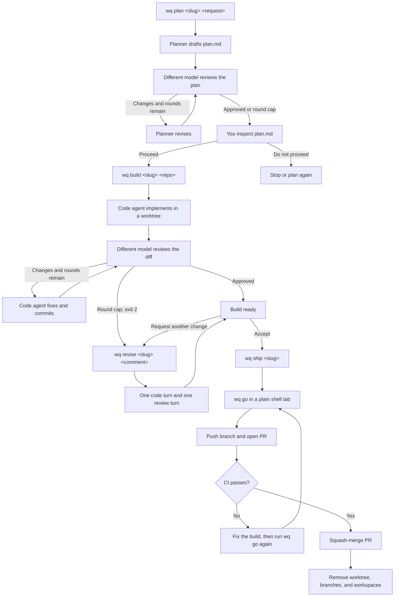

# wq — agent workflows on top of [herdr](https://herdr.dev)

`wq` runs opinionated multi-agent loops in real terminal panes: a planner drafts, a
*different model* reviews adversarially, they iterate under a hard round cap, and the
result ships as a merged pull request.

> **Status: all 13 commands work**, and every one has been driven end to end against a
> real herdr daemon and real agents. The exception is the push-to-merge half of `wq go`,
> which is covered by tests against a fake `gh` rather than by a real merge.

## Two ideas worth stealing, even if you never run this

**1. Cross-model adversarial review with bounded rounds.**
The reviewer is deliberately not the model that wrote. Findings are classified BLOCKING or
NON-BLOCKING, and the reviewer ends its file with exactly one machine-readable line:

```
VERDICT: APPROVED     |     VERDICT: CHANGES
```

Convergence becomes a grep, not an interpretation. Rounds are capped so a disagreeing pair
cannot loop forever. Content moves between panes **by path, never pasted** — the single
largest token sink in a loop like this.

**2. [`docs/behaviors.md`](docs/behaviors.md) — what actually breaks when you drive
coding-agent TUIs unattended.**
Thirteen failure modes discovered the hard way, each with the test that pins it. A pane
reports "ready" while it will silently swallow your prompt. `agent prompt` returning OK
does not mean the agent took the text. `done` is not a state that persists. `gh pr checks`
says "no checks reported" *before* CI starts, which reads exactly like a failure and means
the opposite. If you are scripting Claude Code, Codex, or Amp, you will hit these whether
or not you use herdr.

## Install

```bash
uv tool install herdr-workflow
wq doctor
```

You also need [herdr](https://herdr.dev) running, `git`, and at least two agent CLIs —
`claude` and `pi` are what the defaults assume. `gh` is needed only by `wq ship` / `wq go`.
`wq doctor` checks all of it and explains anything missing.

## Workflow

The same slug carries the plan, build, and review artifacts through the whole workflow.
Both agent loops are bounded; when a cap is reached, you decide whether to continue.



## A worked example

One feature, start to finish. Each command blocks until its agents are done, then tells you
the next one.

```bash
wq plan  auth "add token refresh to the API client"
```

A planner and a reviewer open side by side in their own workspace. The planner writes
`plan.md`; the reviewer attacks it and writes `review.md` ending in a verdict line. They
iterate until it is approved or the round cap is hit. **Read the plan before continuing** —
this is the cheap place to disagree.

```bash
wq build auth ~/code/my-api
```

A worktree on `wq/auth`, cut from whatever your repo actually branches from. A code agent
implements and commits; a *different* model reviews the diff. Exits **2** if the round cap
is reached with findings outstanding, so a script can tell "unreviewed code on a branch"
from "wq broke".

```bash
wq revise auth "use the existing retry helper instead of a new one"
```

One more code turn and one review turn, driven by you rather than by the reviewer. Writes
`revise.patch` — just what this turn changed — alongside the full `diff.patch`.

```bash
wq ship auth
```

Opens a plain shell tab and runs `wq go` there: push, PR, wait for CI, squash-merge, then
remove the worktree, delete both branches and close the workspaces. `ship` returns
immediately; you watch it happen in the tab.

At any point:

```bash
wq list                # what is running; `*` marks the most recently worked build
wq clean auth          # drop it all and start over
```

## Commands

```bash
wq up                              # bring up inbox + router (idempotent)
wq chat       "<message>"          # reuse the inbox chat tab
wq ask        "<question>"         # new inbox tab, scoped to $PWD
wq tidy                            # close finished ask tabs
wq brainstorm <slug> "<idea>"      # interactive; note lands in your notes sink
wq plan       <slug> "<request>"   # plan <-> review loop -> plan.md
wq build      <slug> [repo]        # worktree, code <-> review loop, commit
wq revise     <slug> "<comment>"   # one more code + review round on a build
wq ship       <slug>               # run `wq go` in an inbox shell tab
wq go         <slug>               # push, PR, wait for CI, merge, clean up
wq list                            # show active wq workspaces
wq clean      <slug>               # drop the workspace and scratch dir
wq doctor                          # check the environment
```

Global: `--json`, `--verbose`, `--debug`, `--config`, `--version`.

## Configuration

`~/.config/wq/config.toml`, overridden by `.wq.toml` in the project, overridden by
`WQ_*` environment variables.

```toml
[agents]
plan   = "claude:opus:high"
code   = "claude:sonnet:high"
review = "pi:openai-codex/gpt-5.6-sol:high"   # not the model that wrote

[loops]
plan_rounds = 3
code_rounds = 3

[paths]
root  = "~/Workspace/.wq"
notes = ""    # note sink for `wq brainstorm`

[herdr]
socket = "auto"
```

Roles are `kind:model:level`. Either side of a loop can be either agent — the rule that
matters is that the reviewer is not the model that wrote.

## Development

```bash
git clone https://github.com/henrywang/herdr-workflow
cd herdr-workflow
uv sync
uv run pytest          # no herdr installation required
```

Tests run against a fake herdr daemon (`tests/fake_herdr.py`) that speaks the real
newline-delimited JSON protocol over a real unix socket, so framing, id correlation, and
event interleaving are all under test.

```bash
uv run ruff format . && uv run ruff check . && uv run pyright && uv run pytest
```

Integration tests need a running daemon: `uv run pytest -m integration`.

See [CONTRIBUTING.md](CONTRIBUTING.md) for how the pieces fit together.

- [docs/behaviors.md](docs/behaviors.md) — the failure-mode catalogue, and the most useful
  file here if you are scripting agent TUIs at all
- [docs/protocol-framing.md](docs/protocol-framing.md) — the herdr socket contract, as
  established by probing a real daemon
- [CHANGELOG.md](CHANGELOG.md) — what changed, and the design decisions behind it

## License

MIT
